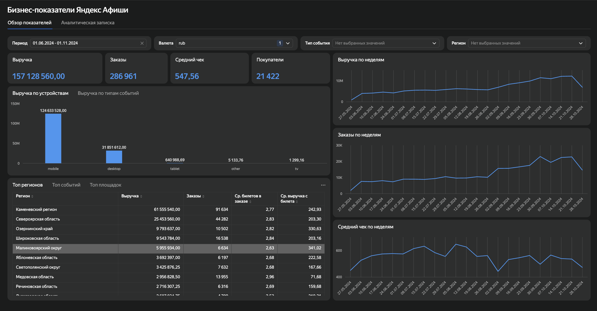

# 📊 Бизнес-показатели Яндекс Афиши

## Описание проекта

Интерактивный дашборд для анализа ключевых бизнес-показателей сервиса Яндекс Афиша.

## Цель проекта

Провести анализ ключевых бизнес-метрик, выявить основные тенденции и подготовить рекомендации на основе данных.

## Что реализовано

- KPI (выручка, заказы, средний чек, уникальные покупатели)
- Фильтрация по периоду, региону, валюте и типу события
- Анализ динамики показателей
- Аналитическая записка
- Практические рекомендации для бизнеса

## Инструменты

- SQL
- Yandex DataLens

## Дашборд

🔗 [Открыть интерактивный дашборд](https://datalens.yandex/4g3dff391fg00)

## Скриншоты

### Главная страница дашборда

