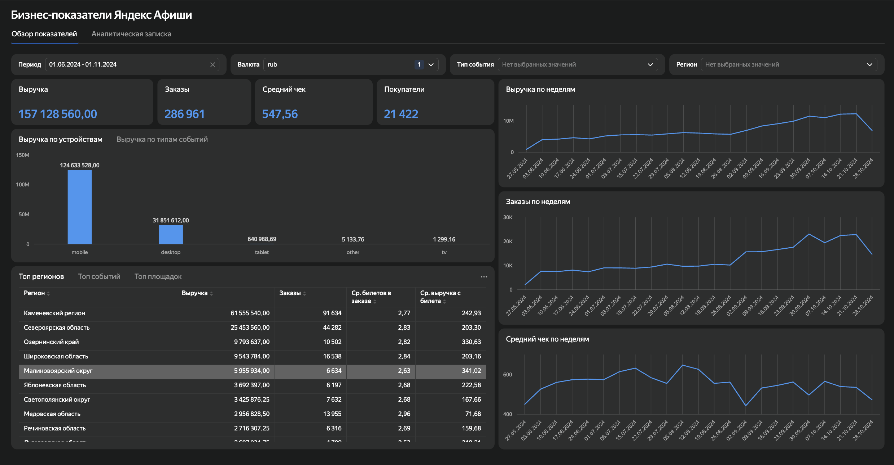

# 📊 Бизнес-показатели Яндекс Афиши

## О проекте

Комплексный аналитический проект по данным сервиса Яндекс Афиша за период с 1 июня по 31 октября 2024 года.

В проекте проведён анализ заказов, мероприятий, пользователей, устройств, регионов и билетных партнёров. Результаты представлены в виде исследовательского анализа на Python, SQL-анализа и интерактивного дашборда в Yandex DataLens.

## Цель проекта

Проанализировать динамику спроса и ключевые бизнес-показатели сервиса, выявить особенности поведения пользователей и структуры продаж, а также подготовить практические рекомендации для бизнеса.

## Что реализовано

- Предобработка и проверка качества данных
- SQL-анализ заказов, мероприятий, регионов и билетных партнёров
- Исследовательский анализ данных в Python
- Анализ сезонной динамики заказов и выручки
- Анализ структуры заказов по типам мероприятий, устройствам и возрастным ограничениям
- Анализ пользовательской активности и поведения
- Статистическая проверка двух гипотез о различиях между mobile и desktop пользователями
- Интерактивный дашборд в Yandex DataLens
- Аналитическая записка с основными выводами
- Практические рекомендации для бизнеса

## Основные результаты

- Осенью спрос на сервис заметно вырос, особенно в сентябре и октябре.
- Количество заказов увеличилось с 33 802 в июне до 99 305 в октябре.
- Наиболее заметно выросла доля спортивных и театральных мероприятий.
- Mobile является основным каналом продаж и формирует около 79% выручки.
- Значительная часть заказов и выручки сосредоточена в нескольких регионах.
- В независимых группах пользователи mobile в среднем совершают больше заказов, чем пользователи desktop.
- Гипотеза о более длительном среднем времени между заказами у mobile статистически не подтвердилась.

## Ключевые показатели

| Метрика | Значение |
|---|---:|
| Выручка | 157 128 560 ₽ |
| Заказы | 286 961 |
| Средний чек | 547,56 ₽ |
| Уникальные покупатели | 21 422 |

## Инструменты

- **Python** — Pandas, NumPy, Matplotlib, SciPy
- **SQL**
- **Yandex DataLens**
- **Jupyter Notebook**

## Файлы проекта

- [`yandex_afisha_analysis.sql`](yandex_afisha_analysis.sql) — SQL-анализ и проверки данных
- [`yandex_afisha_eda.ipynb`](yandex_afisha_eda.ipynb) — исследовательский и статистический анализ
- [`dashboard.png`](images/dashboard.png) — скриншот дашборда

## Дашборд

🔗 [Открыть интерактивный дашборд в Yandex DataLens](https://datalens.yandex/4g3dff391fg00)

## Скриншоты

### Главная страница дашборда

